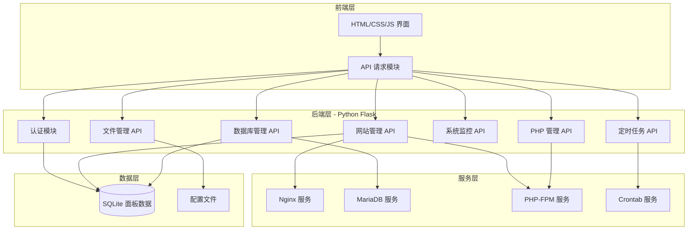

# ZeroPanel v2.0

一款面向 **Linux (Ubuntu/Debian)** 服务器的轻量级建站面板，提供多 PHP 版本、伪静态、在线文件编辑、定时任务等接近宝塔面板的体验。

- **Linux 版**：专为 Ubuntu / Debian 等 Linux 服务器量身定做，支持 systemd 服务管理，同时兼容无 systemd 的容器环境。

---

## 目录

1. [功能特性](#功能特性)
2. [环境支持](#环境支持)
3. [安装教程](#安装教程)
4. [快速上手](#快速上手)
5. [常用命令](#常用命令)
6. [云更新说明](#云更新说明)
7. [常见问题](#常见问题)
8. [技术架构](#技术架构)
9. [API 概览](#api-概览)
10. [项目结构](#项目结构)
11. [安全考虑](#安全考虑)
12. [开发指南](#开发指南)
13. [许可证](#许可证)

---

## 功能特性

| 功能 | Linux 版 |
|---|---|
| 网站管理 | 支持 |
| 数据库管理 | 支持 |
| 文件管理 | 支持 |
| 在线文件编辑 | 支持 |
| 文件在线解压 / 压缩 | 支持 |
| 多 PHP 版本管理 | 支持 |
| PHP 扩展在线安装 | 支持 |
| 网站伪静态规则 | 支持 |
| 网站独立数据库 | 支持 |
| 定时任务（crontab） | 支持 |
| 系统监控 | 支持 |
| 云更新 | 支持 |

---

## 环境支持

### Linux 版

- **Ubuntu** 或 **Debian** 等 Linux 服务器
- 至少 1GB 可用存储空间（包含 Nginx、MariaDB、PHP）
- 建议 Python 3.8 及以上版本

> 面板已适配普通 Linux 服务器：服务启停优先使用 `systemctl`（systemd），其次 `service`（sysvinit），最后回退直接启动守护进程，因此同时兼容带 systemd 的常规服务器与无 systemd 的容器环境。

---

## 安装教程

### 方式一：一键在线安装（推荐）

#### Linux (Ubuntu/Debian)

```bash
bash <(curl -fsSL https://raw.githubusercontent.com/qinfei12/ZeroPanel/trae/agent-zipvKL/install.sh)
```

或直接使用面板专用安装脚本：

```bash
bash <(curl -fsSL https://raw.githubusercontent.com/qinfei12/ZeroPanel/trae/agent-zipvKL/zeropanel/install.sh)
```

安装过程会自动完成：

1. 更新系统软件源
2. 安装 Python 3、Nginx、MariaDB、PHP-FPM 等依赖
3. 为受支持的 Debian/Ubuntu 自动添加 PHP 多版本源 (SURY)
4. 安装 Python 依赖（Flask、Flask-CORS、Werkzeug）
5. 创建 `zeropanel` 快捷命令
6. 启动面板服务

安装完成后访问：

```text
http://localhost:5000
```

默认登录账号：

| 字段 | 值 |
|------|-----|
| 账号 | `admin` |
| 密码 | `admin123` |

> 登录后请立即进入「账号设置」修改默认密码。

### 方式二：手动安装

```bash
apt-get update -y
apt-get install -y python3 python3-pip nginx mariadb-server php-fpm php-mysql curl unzip cron git
pip3 install --break-system-packages flask flask-cors werkzeug || pip3 install flask flask-cors werkzeug
# 克隆仓库并部署面板
git clone -b trae/agent-zipvKL --depth 1 https://github.com/qinfei12/ZeroPanel.git /tmp/zeropanel_src
mv /tmp/zeropanel_src/zeropanel /var/lib/zeropanel
rm -rf /tmp/zeropanel_src
# 面板程序位于 /var/lib/zeropanel，网站目录为 /var/www
zeropanel start
```

---

## 快速上手

### 首次使用配置

1. **修改默认密码**：登录后进入「账号设置」→「修改密码」
2. **创建第一个网站**：进入「网站管理」→「创建网站」，输入域名、端口、选择 PHP 版本
3. **创建数据库**：进入「数据库」→「创建数据库」，或创建网站时勾选“同时创建数据库”
4. **上传网站文件**：进入「文件管理」，上传到网站根目录
5. **设置伪静态**：进入「网站管理」→「编辑」→「伪静态规则」

### 建站流程

```text
安装面板 → 登录 → 安装需要的 PHP 版本 → 安装需要的 PHP 扩展
   → 创建网站（选择 PHP 版本、绑定域名端口）
   → 设置伪静态规则
   → 上传网站源码
   → 创建数据库并导入数据
   → 启动网站
```

---

## 常用命令

安装完成后，可以使用 `zeropanel` 命令管理面板：

```bash
zeropanel start      # 启动面板及相关服务
zeropanel stop       # 停止面板及相关服务
zeropanel restart    # 重启面板
zeropanel status     # 查看面板及 Nginx / MariaDB / PHP-FPM 状态
zeropanel log        # 查看面板运行日志
zeropanel help       # 显示帮助
```

---

## 云更新说明

面板内置云更新功能，可在「系统设置」→「检查更新」中使用。

### 更新流程

1. 点击「检查更新」，面板会从 GitHub 获取最新版本号
2. 如果有新版本，点击「立即更新」
3. 面板会自动备份当前文件到 `data/update_backup/`
4. 下载新版 ZIP 包并解压覆盖
5. 更新完成后需要点击「重启面板」使更新生效

### 版本对应关系

| 版本文件 | 对应面板 | 下载包 |
|---|---|---|
| Linux 版 | `zeropanel/` | GitHub archive（`trae/agent-zipvKL` 分支） |

> 注意：云更新时请勿中断网络，更新失败可通过备份 ZIP 手动恢复。

---

## 常见问题

### 1. 安装过程中提示 `curl: command not found`

```bash
apt-get install -y curl
```

### 2. 安装后访问 `http://localhost:5000` 无响应

检查面板服务是否运行：

```bash
zeropanel status
```

如果没有运行，尝试启动：

```bash
zeropanel start
```

查看日志：

```bash
zeropanel log
```

### 3. 创建网站后无法访问

- 确保网站状态为「运行中」
- 确保端口没有被其他应用占用
- 确保对应 PHP-FPM 版本已安装并运行
- 检查 Nginx 错误日志：`/var/log/nginx/example.com.error.log`

### 4. 如何安装 PHP 扩展

进入面板 →「PHP 管理」→ 选择 PHP 版本 → 点击扩展的「安装」按钮。

支持的扩展包括：redis、mysqli、pdo_mysql、gd、curl、mbstring、xml、zip、bcmath、opcache、intl、fileinfo、exif。

### 5. 如何卸载 ZeroPanel

```bash
zeropanel stop
zeropanel uninstall
```

可选择「仅卸载面板程序」或「完全卸载」：

```bash
# 完全卸载（手动）
rm -rf /var/lib/zeropanel
rm -rf /var/www
rm -f /usr/local/bin/zeropanel
rm -f /etc/nginx/conf.d/zeropanel*.conf
```

> 注意：完全卸载会删除所有网站数据和数据库，请提前备份 `data/` 目录。

---

## 技术架构

### 架构设计



### 技术说明

- **前端**: 原生 HTML5 + CSS3 + JavaScript (ES6+)
- **后端**: Python 3.x + Flask
- **面板数据库**: SQLite
- **网站数据库**: MariaDB / MySQL
- **Web 服务器**: Nginx
- **PHP 处理**: PHP-FPM
- **运行环境**: Linux (Ubuntu / Debian)

---

## API 概览

### 页面路由

| 路由 | 用途 |
|------|------|
| `/` | 登录页面 |
| `/dashboard` | 仪表盘主页 |
| `/websites` | 网站管理 |
| `/databases` | 数据库管理 |
| `/files` | 文件管理 |
| `/monitor` | 系统监控 |
| `/settings` | 账号设置 |
| `/php` | PHP 版本与扩展管理 |
| `/cron` | 定时任务管理 |

### 核心 API

```typescript
// 认证
POST   /api/login
POST   /api/logout
GET    /api/check-auth
POST   /api/account/password

// 网站管理
GET    /api/websites
POST   /api/websites
DELETE /api/websites/:id
POST   /api/websites/:id/start
POST   /api/websites/:id/stop
POST   /api/websites/:id/restart

// 数据库管理
GET    /api/databases
POST   /api/databases
DELETE /api/databases/:name
GET    /api/databases/:name/backup
POST   /api/databases/:name/restore

// 文件管理
GET    /api/files?path=xxx
POST   /api/files/upload
GET    /api/files/download?path=xxx
POST   /api/files/mkdir
POST   /api/files/rename
POST   /api/files/delete
GET    /api/files/read?path=xxx
POST   /api/files/write
POST   /api/files/extract
POST   /api/files/compress

// PHP 管理
GET    /api/php/versions
POST   /api/php/versions
GET    /api/php/extensions?version=x.x
POST   /api/php/extensions
POST   /api/php/fpm/restart

// 伪静态模板
GET    /api/rewrite/templates

// 定时任务
GET    /api/cron
POST   /api/cron
DELETE /api/cron/:id
POST   /api/cron/:id/toggle

// 系统监控
GET    /api/system/info
GET    /api/system/stats
GET    /api/system/services
POST   /api/system/start-services
POST   /api/system/check-update
POST   /api/system/do-update
POST   /api/system/restart
```

---

## 项目结构

```
ZeroPanel/
├── README.md              # 项目文档
├── CHANGELOG.md           # 更新日志
├── VERSION                # 版本号
├── .gitignore             # Git 忽略规则
├── install.sh             # 通用安装入口（Linux 版）
├── zeropanel/             # Linux 版面板
│   ├── app.py             # Flask 主应用
│   ├── install.sh         # Linux 专用安装脚本
│   ├── requirements.txt   # Python 依赖
│   ├── test_verify.py     # 功能验证测试脚本
│   ├── data/              # 运行时数据（自动生成，不入库）
│   ├── static/            # 静态资源
│   └── templates/         # HTML 模板
```

---

## 安全考虑

1. **认证安全**: 密码使用 Werkzeug 的 pbkdf2 加密存储，Session 密钥持久化
2. **输入验证**: 所有用户输入进行严格验证和转义
3. **SQL 注入防护**: 使用参数化查询 + SQL 标识符/字符串安全转义
4. **路径遍历防护**: 文件操作限制在允许目录内（`WWW_DIR`、`DATA_DIR` 等）
5. **命令注入防护**: 系统命令使用列表形式执行，避免 shell 注入

---

## 开发指南

### 本地运行测试

```bash
cd zeropanel
pip3 install -r requirements.txt
python3 test_verify.py
```

### 发布新版本

```bash
# 1. 更新 VERSION 文件
echo "2.1.1" > VERSION
echo "2.1.1" > zeropanel/VERSION

# 2. 追加更新日志到 CHANGELOG.md

# 3. 提交并推送
git add -A
git commit -m "release: v$(cat VERSION)"
git push origin trae/agent-zipvKL
```

> 面板不再使用独立的 `zeropanel_v2.zip` 分发包，云更新直接从 GitHub 仓库
> `trae/agent-zipvKL` 分支下载 archive 并提取 `zeropanel/` 目录。

---

## 许可证

MIT License
